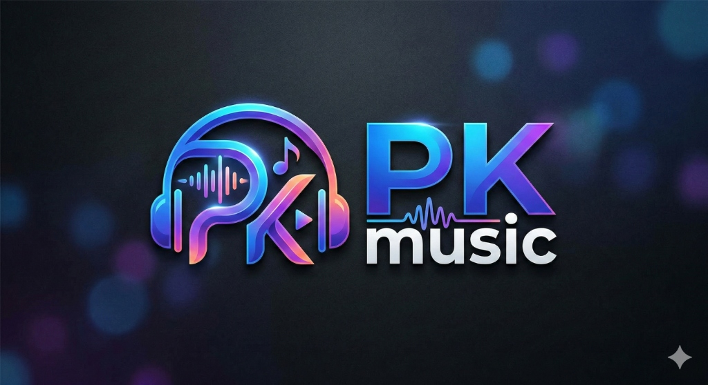

<div align="center">
    
    <h1>PKMusic</h1>
    <p>A premium Android application for streaming music from YouTube Music & JioSaavn</p>
</div>

---

<p align="center">
  
</p>

## Features
- **Premium UI**: Vibrant violet theme with glassmorphism and smooth animations
- **Hybrid Streaming**: Seamless fallback to JioSaavn if YouTube is restricted
- **Background Playback**: Optimized for performance and battery
- **Offline Cache**: Listen to your favorite tracks without internet
- **Advanced Search**: Discover songs, albums, and artists across platforms
- **Android Auto**: Experience PKMusic in your car
- **Customization**: Dynamic themes and adjustable UI settings
- ...

## Installation
The APK can be built using Gradle:
```bash
./gradlew assembleDebug
```
Then install via ADB:
```bash
adb install app/build/outputs/apk/debug/app-debug.apk
```

## Credits & Disclaimer
Original project based on ViMusic.
This project is for educational purposes and is not affiliated with Google or YouTube.
